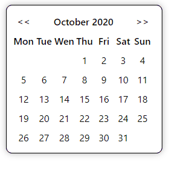

# simple-datepicker

> Simple datepicker for your React app!

[](https://www.npmjs.com/package/simple-datepicker) [](https://standardjs.com)

## Install

```bash
npm install --save simple-datepicker
```

## Exports
* SimpleDatepicker
* useCalendar

## Usage

```tsx
import React, { useState } from 'react'

import { SimpleDatepicker } from 'simple-datepicker'

const Example = () => {

  const [date, setDate] = useState("");

  const handler = (e: string) => setDate(e);

  return (
    <div>
      <SimpleDatepicker onChange={(e) => handler(e.target.value)} />
      {date}
    </div>
  )
}
```
## Presentation



## Properties

### Props of SimpleDatepicker
* onChange

### Logic hook useCalendar actions
* Date - current display date
* MONTHS - months list in full string format
* DAYS_OF_WEEK - days list in short string format
* DaysInMonth - how many days is the month
* ChangeDate - set display date
* CalcNumberDays - return array of Day type objects
* GetShortDate - return short date in format "MMMM-yyyy"
* GetLongDate - return long date in format "dd-MMMM-yyyy"

 ### Day type
 ```tsx
interface Day {
    dateNumber: string;
    dayofweek: number;
}
```

## License

MIT © [ajronn](https://github.com/ajronn)
